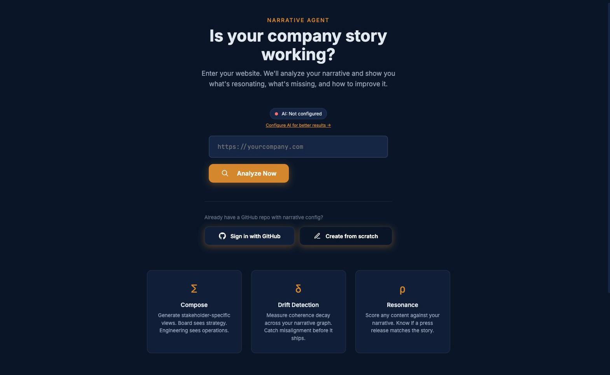

# Image Optimization Guide

## Current Image References in HTML

Your portfolio references these images that need to be added:

### Homepage (index.html)
- `portfolio_image_1.jpg` - Narrative Agent MVP
- `portfolio_image_2.jpg` - Principal AI homepage
- `portfolio_image_3.jpg` - Matter Meter
- `portfolio_image_4.jpg` - Story Gap Mapper
- `portfolio_image_5.jpg` - Story Signal
- `patent_cube.png` - Patent diagram
- `cisco_ai_page.png` - Cisco AI Framework
- `portfolio_audio_1.mp4` - Audio résumé

### Strategy Page
- `strategy_hero.jpg` - Hero image

### Agency Page
- `agency_hero.jpg` - Hero image
- Various campaign images

## Optimization Commands

When you add images, run these commands to optimize them:

```bash
# Install ImageMagick if not already installed
brew install imagemagick

# Install WebP tools
brew install webp

# Create optimized versions
mkdir -p optimized

# For JPG/JPEG files
for img in *.jpg *.jpeg; do
    if [ -f "$img" ]; then
        # Create WebP version (better compression)
        cwebp -q 85 "$img" -o "optimized/${img%.*}.webp"

        # Optimize original JPG
        convert "$img" -quality 85 -strip -interlace Plane -gaussian-blur 0.05 "optimized/$img"

        # Create responsive sizes
        convert "$img" -resize 1920x1920\> -quality 85 "optimized/${img%.*}-large.jpg"
        convert "$img" -resize 1200x1200\> -quality 85 "optimized/${img%.*}-medium.jpg"
        convert "$img" -resize 600x600\> -quality 85 "optimized/${img%.*}-small.jpg"
    fi
done

# For PNG files
for img in *.png; do
    if [ -f "$img" ]; then
        # Create WebP version
        cwebp -q 90 "$img" -o "optimized/${img%.*}.webp"

        # Optimize PNG
        convert "$img" -strip "optimized/$img"

        # Create responsive sizes
        convert "$img" -resize 1920x1920\> "optimized/${img%.*}-large.png"
        convert "$img" -resize 1200x1200\> "optimized/${img%.*}-medium.png"
        convert "$img" -resize 600x600\> "optimized/${img%.*}-small.png"
    fi
done
```

## HTML Picture Element for Responsive Images

Replace image tags with picture elements for better performance:

```html
<!-- Before -->


<!-- After -->
<picture>
  <source srcset="portfolio_image_1.webp" type="image/webp">
  <source srcset="portfolio_image_1-small.jpg" media="(max-width: 600px)">
  <source srcset="portfolio_image_1-medium.jpg" media="(max-width: 1200px)">
  
</picture>
```

## Lazy Loading

Add `loading="lazy"` to all images below the fold:

```html

```

## Image Checklist

Before adding images:
- [ ] Optimize file size (target < 200KB for most images)
- [ ] Create WebP versions
- [ ] Add responsive sizes
- [ ] Include descriptive alt text
- [ ] Use lazy loading for below-fold images
- [ ] Test on slow connections

## Recommended Image Sizes

- Hero images: 1920x1080 max
- Timeline artifacts: 800x600 max
- Thumbnails: 400x300 max
- Icons/logos: SVG when possible

## Performance Budget

Target metrics:
- Total page weight: < 2MB
- Largest Contentful Paint: < 2.5s
- First Input Delay: < 100ms
- Cumulative Layout Shift: < 0.1

Run Lighthouse after adding images to verify performance.